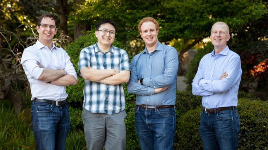
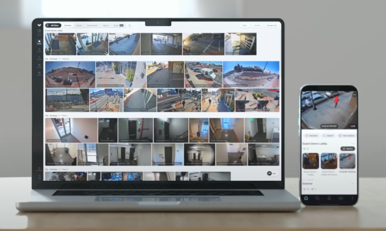
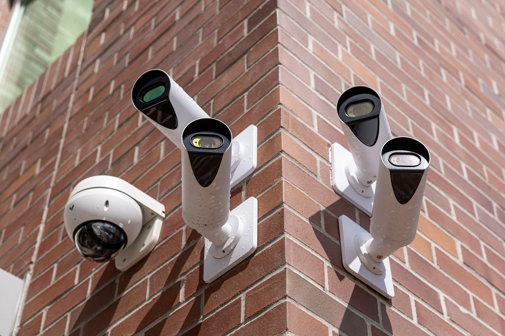
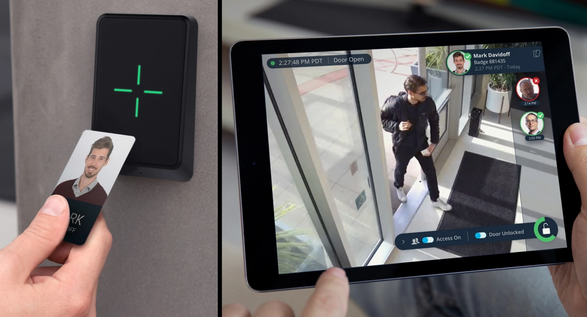
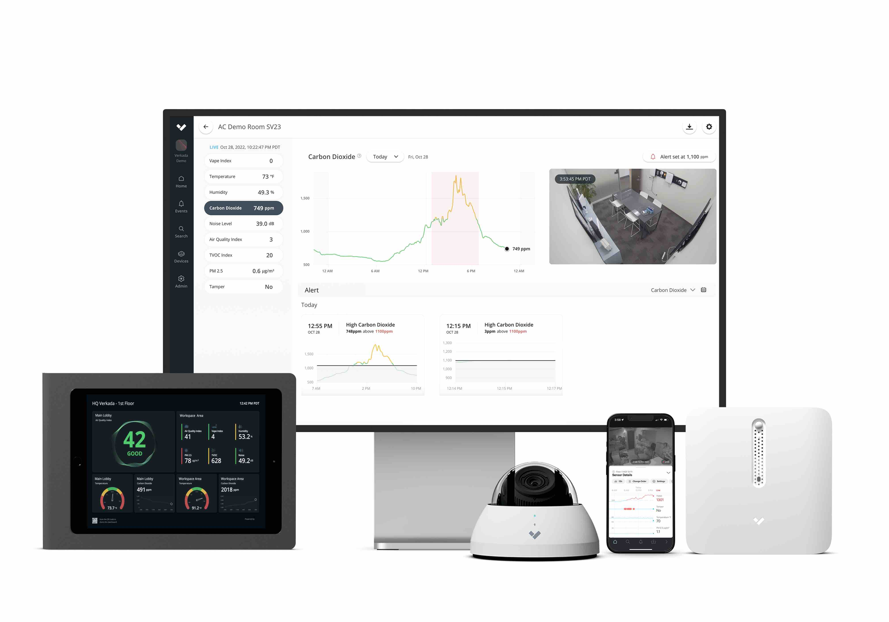
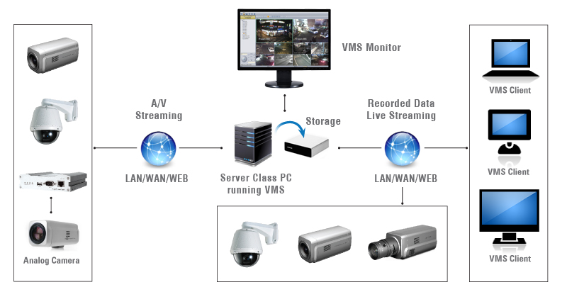
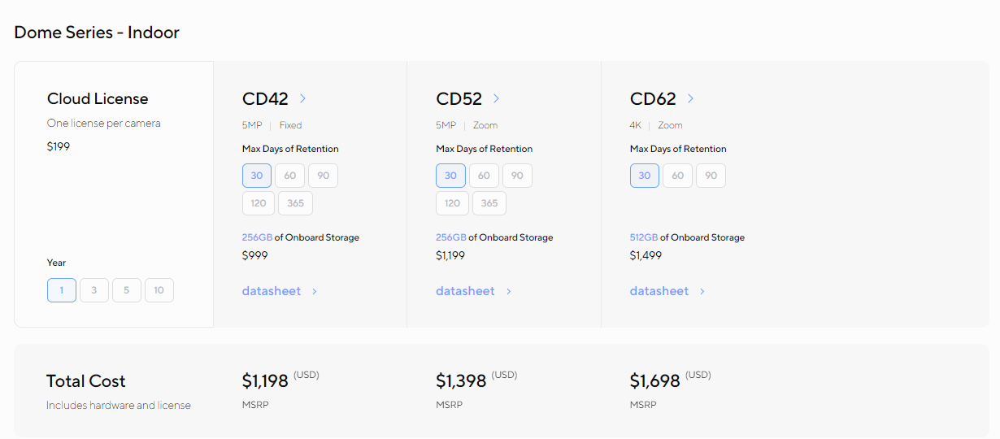
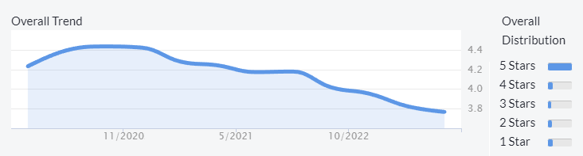
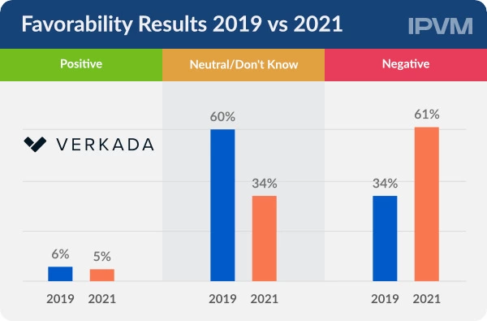

## Thesis

The enterprise security landscape has evolved as traditional analog systems [give way](https://www.securitysales.com/surveillance/integrator-guide-migrating-analog-ip-video/) to cloud-based digital solutions. This change has been fueled by technological advancements and the growing need for real-time monitoring, data analytics, and remote access. Global security and risk management spending reached [$150.4 billion](https://www.gartner.com/en/newsroom/press-releases/2021-05-17-gartner-forecasts-worldwide-security-and-risk-managem) in 2021, driven by [societal changes](https://www.sdmmag.com/articles/100416-state-of-the-market-video-surveillance) like fewer in-person security guards and growing enterprise concern about crime. Concurrently, the growth of the Internet of Things (IoT) has accelerated the adoption of smart devices, with enterprise IoT spending growing 12.1% in 2020 to [$129 billion](https://iot-analytics.com/2021-global-iot-spending-grow-24-percent/). This has created an ecosystem of interconnected sensors, cameras, and other devices that can be centrally managed and analyzed to bolster security measures and streamline operations.

The convergence of a growing need for enterprise security and advancements in physical security technology has led to an increased demand for integrated security solutions. The global physical security market, which includes video surveillance, access control, and intrusion detection, was valued at [$127 billion](https://www.grandviewresearch.com/industry-analysis/physical-security-market) in 2022. In addition, the growing prevalence of [cyber](https://www.gartner.com/en/articles/7-top-trends-in-cybersecurity-for-2022) and [physical security](https://www.asisonline.org/security-management-magazine/latest-news/today-in-security/2022/february/Research-Highlights-Growing-Physical-Security-Threats/) threats has contributed to expanding the enterprise security market. This combination of factors presents an opportunity for businesses seeking to provide solutions for securing organizations and enterprises against potential threats.

Verkada is a physical security platform that offers enterprise security systems that combine modern hardware with intelligent, cloud-based software. Verkada’s hardware and software offerings combine into a fully integrated subscription-based product for video security, access control, and physical security. It sells video security cameras, door-based access control, environmental sensors, and alarms — all connected to a cloud-based platform.

## Founding Story

Source: [Forbes](https://www.forbes.com/sites/alexkonrad/2019/04/25/this-startup-making-security-camera-systems-for-schools-reached-a-540-million-valuation-in-3-years/?sh=458380296d54)

Verkada was founded in 2016 by [Filip Kaliszan](https://www.linkedin.com/in/kaliszan/) (CEO), [Benjamin Bercovitz](https://www.linkedin.com/in/benjaminbercovitz/), [James Ren](https://www.linkedin.com/in/james-ren-2607285/), and [Hans Robertson](https://www.linkedin.com/in/hansrobertson/) (Executive Chairman). 

Prior to Verkada, Kaliszan, Bercovitz, and Ren previously worked together at CourseRank, which was founded by Kaliszan and Bercovitz in 2007 to provide college students an easy way to create and share their course schedule, take classes with friends, and find reviews on classes and professors. CourseRank was acquired by Chegg in [2010](https://techcrunch.com/2010/08/18/cheggs-first-acquisition-courserank/).

The idea for Verkada [came about](https://www.forbes.com/sites/alexkonrad/2019/04/25/this-startup-making-security-camera-systems-for-schools-reached-a-540-million-valuation-in-3-years/?sh=179c48c96d54) when Kaliszan was shopping for a camera to put at the entry of his home. He was initially interested in starting a company focusing on keyless entry, but realized while camera shopping that consumer-oriented video products like Nest didn’t have the features he was looking for, while business-oriented video products felt very outdated. This indicated a gap in the market. He then [joined forces](https://www.forbes.com/sites/alexkonrad/2019/04/25/this-startup-making-security-camera-systems-for-schools-reached-a-540-million-valuation-in-3-years/?sh=179c48c96d54) with Robertson, who had previously co-founded Meraki, a networking business that Cisco acquired for [$1.2 billion](https://techcrunch.com/2012/11/18/cisco-acquires-enterprise-wi-fi-startup-meraki-for-1-2-billion-in-cash/) in [2012](https://techcrunch.com/2012/11/18/cisco-acquires-enterprise-wi-fi-startup-meraki-for-1-2-billion-in-cash/), to found Verkada. 

 After selling the product themselves in the [early days](https://www.forbes.com/sites/alexkonrad/2019/04/25/this-startup-making-security-camera-systems-for-schools-reached-a-540-million-valuation-in-3-years/?sh=179c48c96d54), the team started selling through channel partnerships. They attracted early customers like Equinox by offering to [re-install](https://www.forbes.com/sites/alexkonrad/2019/04/25/this-startup-making-security-camera-systems-for-schools-reached-a-540-million-valuation-in-3-years/?sh=179c48c96d54) existing systems at no charge if customers didn’t love their product.

Starting in 2021, Verkada has faced criticism of a negative [work culture](https://www.bloomberg.com/news/articles/2021-04-09/-bro-culture-at-camera-maker-verkada-pushed-profits-parties?sref=gni836kR) and criticism for potential [abuses](https://techcrunch.com/2022/09/14/vcs-look-the-other-way-as-they-give-205m-more-to-verkada-whose-tech-has-been-abused-repeatedly/) of its technology.

## Product

### Command Platform

Verkada [Command](https://www.verkada.com/command/#overview) is a cloud-based software platform that centralizes managing and monitoring Verkada's suite of security products, including surveillance cameras and access control systems. Accessible via a web browser or mobile app, Command allows users to view live and recorded video footage, manage user access permissions, and configure device settings from a single user interface.

Source: [YouTube](https://www.youtube.com/watch?v=36J_VGN0YTw)

### Video Security

Verkada offers a suite of [security camera](https://www.verkada.com/security-cameras/) products that integrate with the Command platform. The tight integration enables a [quicker](https://getsafeandsound.com/2021/10/verkada-review/), [easier](https://www.youtube.com/watch?v=HslhUyuYRng) set up relative to competitors. The cameras provide live and recorded video feeds and enable the Command platform to send alerts to users based on predefined parameters like motion detection or object recognition. Customers can store up to [365](https://www.verkada.com/security-cameras/) days of footage directly on the camera without needed DVRs or servers. Verkada cameras store footage locally and send encrypted thumbnails to the cloud. 

Source: [Bloomberg](https://www.bloomberg.com/news/articles/2021-03-15/major-tech-supplier-stops-selling-verkada-cameras-after-hack)

Verkada has five cameras: Dome Series, Bullet Series, Mini Series, Fisheye Camera, and Multisensor Camera.

### Access Control

Access Control enables organizations to manage physical entry points, such as doors and gates, through its Command platform. Verkada’s access control hardware, compromised of electronic door controllers and card readers, integrates with Verkada’s Command software. Users can grant or revoke access permissions for individuals or groups based on time, location, and security clearance. The access control product complements Verkada’s video security offerings, allowing video footage to correlate with access events in the Command platform. Users can add unlimited doors, credentials, and buildings using Verkada’s Access Control. Customers can also enable their employees to use their phones to unlock doors with a tap, eliminating the need for physical keycards.

Source: [TechCrunch](https://techcrunch.com/2020/01/29/verkada-security/)

### Intercom

Verkada’s [Intercom](https://www.verkada.com/intercom/) is a communication system that facilitates secure entry management. The Intercom consists of a video receiver that can communicate with Verkada’s Command app on a web browser, the Verkada Pass app on mobile, or directly to a phone number. The Intercom system supports two-way audio communication and video verification, allowing authorized personnel to grant or deny access to visitors remotely.

Source: [Verkada](https://www.verkada.com/blog/announcing-verkada-intercom-answer-calls-from-anywhere/)

### Air Quality

Verkada's [air quality](https://www.verkada.com/air-quality/) product is an environmental sensor designed to monitor and analyze indoor air quality in real time. The data collected by the air quality sensors are stored and analyzed in the cloud, allowing administrators to access historical trends, receive alerts on potential issues, and remotely manage the devices from any internet-connected device.

Source: [Verkada](https://www.verkada.com/blog/announcing-better-air-quality-monitoring-with-verkada/)

### Workplace

Verkada’s Workplace offering is a set of services that are intended to streamline workplace operations, like checking in guests and receiving mailroom deliveries. 

- [Verkada Guest](https://www.verkada.com/guest-visitor-management-system/) is a visitor management system that streamlines the guest check-in process and works with Verkada’s video security and access control offerings.
- [Verkada Mailroom](https://www.verkada.com/mailroom-delivery-management/) is a package tracking and delivery management solution that helps organizations handle incoming packages and mail. After scanning a package label, the Verkada Mailroom app sends notifications to the intended recipients. It secures the package until the pickup by working with Verkada’s video security products.

Source: [Verkada](https://www.verkada.com/blog/introducing-verkada-mailroom/)

### Alarms

Verkada’s Alarms product is an integrated security solution for intrusion detection, deterrence, and response. Verkada offers a monitoring service with operators evaluating live footage where customers can determine the areas to cover, arm/disarm schedule, and how operators should respond to potential threats. Wireless intrusion sensors and alarm panels allow customers to detect potential intrusions. Speakers and alarm consoles also enable customers to deter threats by playing sounds or speaking to would-be intruders. There’s also a customizable panic button that allows users to call for help. 

## Market

### Customer

Verkada's ideal customers are enterprises or organizations with physical facilities that need to be secured. This includes businesses of all sizes, from small and medium-sized enterprises to large corporations. Verkada works across industries including education, government, financial services, retail, healthcare, restaurants, and property management. Common use cases include emergency response, license plate recognition, lockdown management, touches entry, and vape detection.

Because Verkada’s products are cloud-based and do not require on-premise servers, the company targets customers who either have difficulty with or a limited appetite for maintaining an in-house IT team that would normally manage an on-premise security system. 

### Market Size

Verkada serves the enterprise physical security market, which includes video surveillance and access control segments. The global video surveillance market was valued at [$43 billion](https://www.alliedmarketresearch.com/Video-Surveillance-market) in 2019 and is expected to grow at a CAGR of 14.6% to reach $145 billion by 2027. The access control market was valued at [$10.3 billion](https://www.fortunebusinessinsights.com/access-control-market-104592) in 2019 and is projected to expand at an 8.7% CAGR to reach $20 billion by 2027.

Key [drivers](https://www.marketsandmarkets.com/Market-Reports/video-surveillance-market-645.html) for growth in these markets include increasing security concerns, rapid technological advancements, and the rising adoption of cloud-based services and IoT devices. Security system integrators see a promising future for the industry, with [65%](https://www.sdmmag.com/articles/100416-state-of-the-market-video-surveillance) of respondents in a survey rating the current state of the video surveillance market as “Excellent / Very Good.” Verkada's integrated security solutions position the company to capitalize on the growing demand for comprehensive security systems.

## Competition

**Spot AI**: Founded in [2018](https://www.crunchbase.com/organization/spot-d1d1), [Spot AI](https://www.spot.ai/) is a video security and analytics company that positions itself as a competitor to Verkada in video surveillance. Spot AI's platform leverages machine learning to enable real-time video analytics, object detection, and event recognition in cloud and on-premise deployments. Spot AI has gained [traction](https://www.spot.ai/customers/overview) with enterprise clients across various retail, healthcare, and manufacturing sectors. In November 2022, Spot AI closed a [$40 million](https://www.spot.ai/blog/spot-ai-closes-40-million-series-b-to-transform-data-from-the-worlds-billion-business-cameras-into-video-intelligence) Series B funding round led by Scale Venture Partners, bringing its total funding to $62 million. Spot AI's software has positioned the company as a competitor to Verkada’s Command platform.

**Avigilon:** [Avigilon](https://www.avigilon.com/) is a Canadian Motorola subsidiary specializing in surveillance cameras, access control products, and video management software. Founded in [2004](https://www.zippia.com/avigilon-careers-1397432/history/), Avigilon went public in [2011](https://www.zippia.com/avigilon-careers-1397432/history/) and was acquired by Motorola in 2018 for [$1 billion](https://www.bloomberg.com/news/articles/2018-02-02/motorola-solutions-sees-opening-with-1-billion-avigilon-deal). Security system integrators rated Avigilon as their [third favorite](https://ipvm.com/reports/favorite-camera-2022) camera manufacturer and their [#1 VMS](https://ipvm.com/reports/fav-vms-2020) product in 2020. In [2021](https://www.motorolasolutions.com/newsroom/press-releases/motorola-solutions-to-acquire-cloud-based-mobile-access-control-provider-op.html), Motorola acquired Openpath, a cloud-based access control provider, and also [acquired](https://www.motorolasolutions.com/newsroom/press-releases/motorola-solutions-acquires-envysion-leader-in-enterprise-video-security-an.html) Envysion, an enterprise video security company that provided video security solutions as a subscription service the same year. Then, in [2022](https://www.motorolasolutions.com/newsroom/press-releases/motorola-solutions-acquires-ava-security-limited--a-global-provi.html), Motorola acquired Ava, a cloud-based video security analytics provider. These recent acquisitions, particularly of access control and cloud-based providers, puts it in direct competition to several segments of Verkada’s product portfolio.

**Axis Communications:** [Axis Communications](https://www.axis.com/en-us) is a Swedish manufacturer of video cameras, access control hardware, and other physical security devices. Operating as an independent subsidiary of Canon since its acquisition in [2015](https://www.securityinfowatch.com/video-surveillance/article/12043606/canon-to-acquire-axis-communications), Axis Communications has been manufacturing security devices for almost 40 years since its founding in 1984. In an industry group survey, Axis was [rated](https://ipvm.com/reports/favorite-camera-2022) the favorite camera manufacturer of video security integrators and is a [market leader](https://www.mordorintelligence.com/industry-reports/video-surveillance-systems-market) in the video surveillance market. Axis competes against Verkada with its security camera and access control hardware offerings.

**Hanhwa:** [Hanhwa Vision](https://www.hanwhavision.com/en/) is a video security company that manufactures video camera hardware. Founded in 1977, Hanwha Vision is a subsidiary of the South Korean business conglomerate Hanwha Group. Hanhwa has grown since acquiring Samsung’s video surveillance business in [2014](https://ipvm.com/reports/samsung-surveillance-sold-off) and has benefitted from market leader Axis Communications experiencing [supply shortages](https://ipvm.com/reports/man-gain-lose-2022) in recent years. Hanhwa competes with Verkada in the security camera hardware and video management system (VMS) segments. Hanwha’s VMS offering was the [highest-ranked](https://ipvm.com/reports/2023-man-trends) VMS when surveyed by security system integrators. 

## Business Model

Verkada's subscription-based business model combines integrated hardware and software in a direct-to-cloud security solution. The company operates with a [VSaaS](https://ipvm.com/reports/vsaas-101) (video surveillance as a service) model, disrupting the traditional enterprise security model, which typically involves the following components:

- **Camera**. Video cameras that capture footage and stream the video to an on-prem server or storage. The customer generally pays a one-time fee for the purchase and installation of the cameras. The customer is usually free to purchase and use cameras from any company.
- **Server Hardware**. On-prem computing hardware for decoding, storing, and streaming video data. The customer pays a one-time fee to purchase and install server hardware. The server hardware is a commodity with no vendor lock-in.
- **Video Management System**. A software application that receives video data from the server hardware and renders it in a user interface that customers can interact with on a computer or mobile device. VMS applications typically support various cameras, and the customer can choose the best application. A VMS requires a one-time license fee or ongoing subscription cost.

Source: [Marshall](https://www.marshall-usa.com/software/images/NVR-1_diagram.jpg)

The VSaaS business model of Verkada involves vertically integrating all of the components of traditional enterprise security solutions into a single subscription. Customers do not purchase their cameras, buy their server hardware, and select a specific VMS individually. Instead, if they choose Verkada, Verkada supplies everything required. A Verkada subscription includes the following:

- **Hardware**. Customers select the types of sensors (cameras, access control devices, alarms, etc.) based on their needs. The price of the subscription includes the cost of the sensors. Verkada sensors are only compatible with Verkada’s software platform, meaning customers cannot purchase or use sensors from other companies.
- **Storage**. Video and sensor data captured is streamed and stored in a cloud managed by Verkada. Customers can customize the amount of on-device storage, which affects the subscription price.
- **Software Platform**. Verkada’s Command software platform is natively integrated with all of Verkada’s sensors and cloud storage. Customers configure, view, and interact with their sensors and data through the software platform. The software platform only supports Verkada’s hardware.

Source: [Verkada](https://www.verkada.com/pricing)

Verkada offers an estimate of the total cost of its subscription. For a single CD42 Indoor Security Camera, the [pricing](https://www.verkada.com/pricing/#dome-series-indoor) is as follows:

- 1 Year: ~$1.2K
- 3 Years: ~$1.5K
- 5 Years: ~$1.9K
- 10 Years: ~$2.8K

## Traction

In 2020, the company cited [2.5K](https://techcrunch.com/2020/01/29/verkada-security/) clients, including 25 Fortune 500 companies. Over the next two years, its customer count quadrupled to over [13K](https://techcrunch.com/2022/09/14/vcs-look-the-other-way-as-they-give-205m-more-to-verkada-whose-tech-has-been-abused-repeatedly/) as of September 2022. As of April 2023, the company stated that over [15.7K](https://www.verkada.com/customers/) enterprise organizations use Verkada’s security solutions. Verkada’s notable customers [include](https://www.verkada.com/customers/) the City of Los Angeles, Virgin Hyperloop, Citrix, Equinox Fitness Club, and the London Clinic. 

## Valuation

In [September 2022](https://finance.yahoo.com/news/verkada-raises-205m-build-operating-114400370.html), Verkada raised $205 million in a Series D led by Linse Capital, which valued the enterprise security company at [$3.2 billion](https://finance.yahoo.com/news/verkada-raises-205m-build-operating-114400370.html). Key investors also included Sequoia Capital, First Round Capital, Felicis, and Next47. Verkada has raised [$344 million](https://www.crunchbase.com/organization/verkada/company_financials) in total financing. In 2021, the security industry research group IPVM released a report estimating Verkada’s 2021 revenue at [$130 million](https://ipvm.com/reports/verkada-130). At a $3.2 billion valuation, Verkada is valued at a 25x multiple. This estimation does not account for revenue growth from 2021 to 2022.

## Key Opportunities

### Smart Building Management

One opportunity for Verkada is to develop new products that integrate with smart building technologies, such as energy management systems, HVAC controls, and lighting systems. Verkada’s existing product portfolio focuses on physical security. But the company started making inroads into the facility management market by releasing its air quality sensor products in [2022](https://www.verkada.com/blog/announcing-better-air-quality-monitoring-with-verkada/). By combining its physical security offerings with new facility management products, Verkada could offer customers an all-in-one smart building solution. The global smart building market is projected to reach [$201 billion](https://www.alliedmarketresearch.com/smart-building-market) by 2031, representing a CAGR of 11.3% from 2022 to 2031. Verkada’s focus on cloud-based technology and user-friendly interfaces could give it a competitive edge in attracting new customers and expanding its addressable market.

### Predictive Surveillance

Artificial intelligence and machine learning advancements present an opportunity for Verkada to enhance its security offerings. [Predictive surveillance](https://www.deloitte.com/global/en/Industries/government-public/perspectives/urban-future-with-a-purpose/surveillance-and-predictive-policing-through-ai.html) utilizes AI and machine learning to proactively anticipate potential security threats before they occur. In contrast, traditional reactive surveillance relies on human monitoring and manual intervention, responding to security events only after they have occurred, which can be slower and less efficient. Over [78%](https://www.accenture.com/_acnmedia/pdf-100/accenture-future-of-physical-security-whitepaper.pdf) of business leaders stated that the digital transformation of physical security would generate a significant ROI. The adoption of AI coupled with video surveillance is seeing mainstream adoption, with the city of Paris [planning](https://www.ifsecglobal.com/video-surveillance/tensions-rise-over-frances-plan-for-ai-video-surveillance-at-paris-olympics/) on using AI video surveillance for the 2024 Paris Olympics. Verkada's focus on software-enabled products represents an opportunity for embracing AI-enabled surveillance capabilities as a natural extension of its existing product lineup.

## Key Risks

### Company Culture

In [October 2020](https://www.theverge.com/2020/10/26/21535089/surveillance-company-verkada-harassed-female-employees), Verkada employees reported an incident where a Verkada sales director used to access the company’s security system to take photos of female employees and post them in a Slack channel with sexually graphic content. A group of men in leadership positions on the sales team who were part of the Slack channel were alleged to have contributed to a culture of sexism at the company, where former employees [described](https://techcrunch.com/2022/09/14/vcs-look-the-other-way-as-they-give-205m-more-to-verkada-whose-tech-has-been-abused-repeatedly/) the company as tolerant of harassment.

Source: [Glassdoor](https://www.glassdoor.com/Reviews/Verkada-Reviews-E2153775.htm)

Some employees found Verkada leadership’s initial response, which gave the offending employees the [option](https://www.vice.com/en/article/pkdyqm/surveillance-startup-used-own-cameras-to-harass-coworkers) of either leaving the company or having their share of stock reduced, to be inadequate. Verkada later [terminated](https://www.vice.com/en/article/pkdyqm/surveillance-startup-used-own-cameras-to-harass-coworkers) the offending employees after negative employee feedback and media coverage. In a later incident in early [2021](https://finance.yahoo.com/news/bro-culture-camera-maker-verkada-154144887.html), Verkada terminated a sales manager for exposing himself to a female colleague at an out-of-office gathering. Such incidents at Verkada could threaten the company’s reputation and employee morale, and in turn adversely affect Verkada’s ability to hire and retain top talent.

### Cybersecurity

In [March 2021](https://www.bloomberg.com/news/articles/2021-03-09/hackers-expose-tesla-jails-in-breach-of-150-000-security-cams), a group of hackers breached Verkada and obtained access to the live feeds of 150K surveillance cameras. The hackers could view video footage from Verkada customers, including Tesla, Cloudflare, and other privacy-conscious organizations like women’s health clinics, police stations, and hospitals.

Source: [Bloomberg](https://www.bloomberg.com/news/articles/2021-03-09/hackers-expose-tesla-jails-in-breach-of-150-000-security-cams)

The hackers were relatively unsophisticated and gained access to Verkada through a “Super Admin” account by finding a username and password for an administrator account publicly exposed on the internet. According to a [member](https://www.theverge.com/2021/3/9/22322122/verkada-hack-150000-security-cameras-tesla-factory-cloudflare-jails-hospitals) of the hacker group that breached the system, the hack was intended to show how easily Verkada’s system could be hacked. This breach directly undermined Verkada’s core mission of providing secure surveillance solutions for customers and also damaged Verkada’s reputation. Reduced customer trust from this incident and others, if they should occur, are likely to place the company at a competitive disadvantage in an industry where robust security is paramount.

### Vendor Lock-In

Verkada’s innovation in combining the enterprise security stack into a single subscription-based offering means that Verkada customers are locked-in. Unlike traditional competitors, where a customer might choose security cameras from Axis, access control devices from Hanwha, and a VMS software platform from Avigilon, all these components would work on common integration protocols; Verkada’s products form a closed, proprietary ecosystem. 

Enterprise security industry group IPVM tested this and [concluded](https://ipvm.com/reports/verkada-lock-out) that Verkada’s cameras and other hardware products could not be effectively used if a customer did not have an active, paid subscription. The incumbent enterprise security industry highlights that customers can purchase and be locked out from using hardware they have paid for, framing the subscription-based lock-in as “[hostage as a service](https://ipvm.com/reports/hostage-as-a-service).”

Source: [IPVM](https://ipvm.com/reports/verkada-fav-21)

A [survey](https://ipvm.com/reports/verkada-fav-21) of over 200 security system integrators, who are specialized professionals with domain expertise in designing, installing, and maintaining security solutions for clients, found these respondents had an overwhelmingly negative opinion of Verkada. As companies become more aware of the potential downsides of vendor lock-in, they may seek solutions that offer greater flexibility and avoid over-reliance on a single provider. Customers concerned about vendor lock-in may be hesitant to commit to Verkada's platform, fearing that they will be unable to easily switch to alternative solutions if their needs change or if they become dissatisfied with Verkada's offerings.

## Summary

Security concerns and rapid technological advancements are driving growth in the enterprise physical security market, particularly in the video surveillance and access control segments. Verkada is well-positioned to capitalize on this trend with its integrated security solutions, having shown significant traction with organizations of various types and sizes. By providing a comprehensive security product that combines video surveillance, access control, and alarms, Verkada aims to address the growing demand for advanced security technology. However, the fallout from Verkada’s internal conflicts and 2021 data breach present challenges to its reputation and customer trust. To succeed, Verkada must continue delivering innovative enterprise management products and develop a long-term track record of success to ensure it remains a top choice for organizations seeking enterprise security solutions.